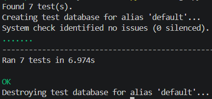

# Zorvyn Finance

## Project Overview
Zorvyn Finance is a Django-based financial record management system with role-based access control (RBAC). Built with Django 6.0, Django REST Framework, SQLite, and JWT authentication, it provides secure APIs for managing financial records, analytics dashboards, and user management across three distinct roles.

## Setup Instructions

```bash
# Clone the repository
git clone <repository-url>
cd zorvyn-finance

# Create and activate virtual environment
python -m venv venv
venv\Scripts\activate  # On Windows
source venv/bin/activate  # On Unix/MacOS

# Install dependencies
pip install -r requirements.txt

# Run migrations
python manage.py migrate

# Create superuser (optional)
python manage.py createsuperuser

# Start development server
python manage.py runserver
```

The API will be available at `http://localhost:8000/api/`

## Role Model & Assumptions

**Three-tier RBAC system:**

- **Viewer**: Read-only access to financial records and dashboard analytics. Cannot create, update, or delete records.
- **Analyst**: Read access plus ability to view insights and advanced analytics. Can generate reports but cannot modify records.
- **Admin**: Full CRUD access to financial records, user management capabilities, and complete dashboard access.

**Key Assumptions:**
- Users can only access their own financial records, not other users' data (data isolation by user).
- Role assignment is managed by superusers during user creation/update.
- A user has exactly one role (no multi-role support).
- Financial records include amount, category, date, and description fields with basic validation.
- Dashboard aggregates data only for the authenticated user's records.

## API Overview

The system provides 15 RESTful endpoints across authentication, financial records management, and dashboard analytics. Full API documentation including request/response schemas, authentication headers, and example payloads is available at:

**[API Documentation](https://docs.google.com/document/d/1iMnR3k_sPM02lpEn7lTMygv_g9JOONjTIYtZ3nvKRYw/edit?usp=sharing)**

## Access Control Design

Permission enforcement uses custom DRF permission classes (`CanViewRecords`, `CanModifyRecords`, `CanAccessDashboard`, `CanManageUsers`) that check the authenticated user's role against the required permission for each endpoint. Permissions are applied at the view level using `permission_classes` and compose with DRF's `IsAuthenticated`. The design follows a deny-by-default principle: if no permission class explicitly allows the action, access is denied. This maps cleanly to business logic — Viewers get read-only access through `CanViewRecords`, Analysts can modify records via `CanModifyRecords`, and Admins have unrestricted access including user management through `CanManageUsers`.

## Optional Enhancements Implemented

- **JWT Authentication**: Token-based auth with refresh mechanism using `djangorestframework-simplejwt`
- **Pagination**: Page-based pagination for financial records list (default page size: 20)
- **Search & Filtering**: Django-filter integration for category, date range, and amount filtering
- **Unit Tests**: Comprehensive test suite covering authentication, CRUD operations, permissions, and edge cases
- **Input Validation**: Serializer-level validation for amounts, dates, and required fields
- **User Management Endpoints**: Admin-only endpoints for viewing and managing users

## Running the Tests

```bash
python manage.py test finance
```

All 7 test cases pass, covering authentication flows, role-based permissions, CRUD operations, and data isolation.



*All 7 unit tests passing — permissions, validation, and dashboard summary.*

## Tradeoffs & Known Limitations

**Tradeoffs:**
- **Validation Logic**: Amount and date validation is duplicated across serializers. In production, would refactor to shared validator functions or custom field classes.
- **SQLite**: Used for simplicity and zero-configuration setup. Production deployment would use PostgreSQL for better concurrency, data integrity, and performance.
- **Denormalized Dashboard**: Dashboard aggregations query records on-demand. For large datasets, would implement materialized views or caching.

**Known Limitations:**
- No rate limiting on authentication endpoints (vulnerable to brute force).
- No soft delete for financial records (deletions are permanent).
- No audit trail for record modifications.
- Single currency support (no multi-currency handling).
- No export functionality (CSV/PDF reports).

**Future Enhancements:**
- Add pagination to dashboard endpoints for large aggregations.
- Implement rate limitation.
- Add comprehensive API versioning strategy.
- Introduce background task processing for analytics using Celery.
